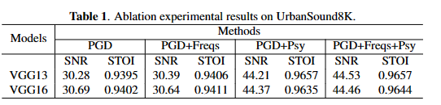

# BOOSTING IMPERCEPTIBILITY OF ADVERSARIAL ATTACKS FOR ENVIRONMENTAL SOUND CLASSIFICATION

This code is the submission for the anonymously submitted paper titled 'Boosting Imperceptibility of Adversarial Attacks for Environmental Sound Classification' to ICME2024.

<div align="center">
  
  <p>Framework of our FreqPsy Attack Algorithm</p>
</div>

## Requirements

````
numpy==1.26.2
librosa==0.10.1
pystoi==0.3.3
pandas==1.5.3
sklearn==0.0.post1
scikit-learn==1.1.3
eagerpy==0.30.0
foolbox==3.3.3
tqdm==4.64.1
scipy==1.11.4
````

## Training Model

Train two models including VGG13 and VGG16. Please download the dataset from the following link and put it in the
`dataset` folder. 

[UrbanSound8K](https://www.kaggle.com/datasets/chrisfilo/urbansound8k)

[ESC-50](https://github.com/karolpiczak/ESC-50)

Below is an example.
```
cd FPAA
python train_model.py --dataset Urban8K --model VGG13 --batch_size 32 --num_epochs 100 --lr 0.0001
```

## Select a portion of the data that each model can predict successfully

We filter the ESC-50 dataset and store the results in the variable "esc_data". However, you need to filter the UrbanSound8K data set yourself. More specifically, in the UrbanSound8K dataset, please filter 50 data per category, while in the ESC-50 dataset, please select 10 data per category.

## Generate adversarial examples

We use four attack algorithms to generate adversarial examples, including FGSM, BIM, PGD, and our proposed FPAA. The
following is an example. If you run the method we proposed, you need to specify the values of lr_stage, num_iter_stage,
and alpha. The other methods do not need to be specifically specified (because these parameters are the parameters used
in the method we proposed).

```
python run_attack.py --dataset Urban8K --model VGG13 --lr_stage 0.001 --num_iter_stage 500 --epsilon 0.1 --attack_method PGD_freq --save_path adv_example --alpha 0.07
```
We have generated adversarial examples on the ESC-50 data set.
## Ablation Experiment
<div align="center">
  
</div>

|  **Attack**  |     **Package**     |     Standard |     [Wong2020Fast](https://arxiv.org/abs/2001.03994) |     [Rice2020Overfitting](https://arxiv.org/abs/2002.11569) |     **Remark**     |
| :----------------: | :-----------------: | -------------------------------------------: | -------------------------------------------: | ---------------------------------------------: | :----------------: |
|      **FGSM** (Linf)      |    Torchattacks     | 34% (54ms) |                                 **48% (5ms)** |                                    62% (82ms) |                    |
|  | **Foolbox<sup>*</sup>** | **34% (15ms)** |                                     48% (8ms) |                  **62% (30ms)** |                    |
|                    |         ART         | 34% (214ms) |                                     48% (59ms) |                                   62% (768ms) |                    |
| **PGD** (Linf) |    **Torchattacks** | **0% (174ms)** |                               **44% (52ms)** |            **58% (1348ms)** | :crown: ​**Fastest** |
|                    | Foolbox<sup>*</sup> | 0% (354ms) |                                  44% (56ms) |              58% (1856ms) |                    |
|                    |         ART         | 0% (1384 ms) |                                   44% (437ms) |                58% (4704ms) |                    |
| **CW<sup>† </sup>**(L2) |    **Torchattacks** | **0% / 0.40<br /> (2596ms)** |                **14% / 0.61 <br />(3795ms)** | **22% / 0.56<br />(43484ms)** | :crown: ​**Highest Success Rate** <br /> :crown: **Fastest** |
|                    | Foolbox<sup>*</sup> | 0% / 0.40<br /> (2668ms) |                   32% / 0.41 <br />(3928ms) |                34% / 0.43<br />(44418ms) |  |
|                    |         ART         | 0% / 0.59<br /> (196738ms) |                 24% / 0.70 <br />(66067ms) | 26% / 0.65<br />(694972ms) |  |
| **PGD** (L2) |    **Torchattacks** | **0% / 0.41 (184ms)** |                  **68% / 0.5<br /> (52ms)** |                  **70% / 0.5<br />(1377ms)** | :crown: **Fastest** |
|                    | Foolbox<sup>*</sup> | 0% / 0.41 (396ms) |                       68% / 0.5<br /> (57ms) |                     70% / 0.5<br /> (1968ms) |                    |
|                    |         ART         | 0% / 0.40 (1364ms) |                       68% / 0.5<br /> (429ms) | 70% / 0.5<br /> (4777ms) |                           |
